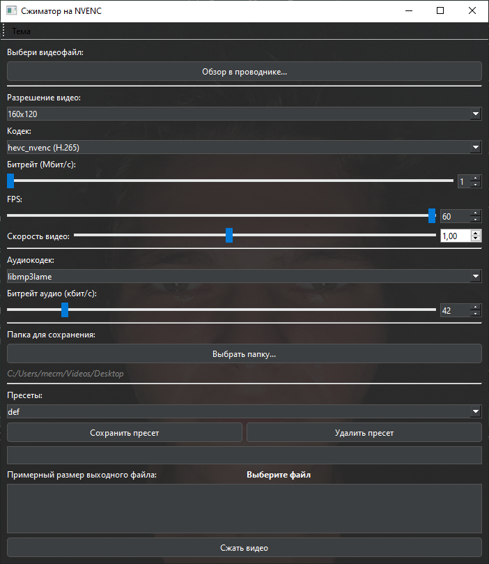

# 🎥 Сжиматор на NVENC

![GitHub](https://img.shields.io/github/license/sharkye1/Szhimatar?style=for-the-badge&label=Download%20license&labelColor=yellow&color=magenta&link=https%3A%2F%2Fimg.shields.io%2Fgithub%2Flicense%2Fsharkye1%2FSzhimatar%3Fstyle%3Dfor-the-badge%26color%3Dmagenta%26cacheSeconds%3Dhttps%253A%252F%252Fgithub.com%252Fsharkye1%252FSzhimatar%252Fraw%252Frefs%252Fheads%252Fmain%252F%2525D0%25259B%2525D0%252598%2525D0%2525A6%2525D0%252595%2525D0%25259D%2525D0%252597%2525D0%252598%2525D0%25259E%2525D0%25259D%2525D0%25259D%2525D0%25259E%2525D0%252595%252520%2525D0%2525A1%2525D0%25259E%2525D0%252593%2525D0%25259B%2525D0%252590%2525D0%2525A8%2525D0%252595%2525D0%25259D%2525D0%252598%2525D0%252595%252520%2525D0%25259D%2525D0%252590%252520%2525D0%252598%2525D0%2525A1%2525D0%25259F%2525D0%25259E%2525D0%25259B%2525D0%2525AC%2525D0%252597%2525D0%25259E%2525D0%252592%2525D0%252590%2525D0%25259D%2525D0%252598%2525D0%252595%252520%2525D0%25259F%2525D0%2525A0%2525D0%25259E%2525D0%252593%2525D0%2525A0%2525D0%252590%2525D0%25259C%2525D0%25259C%2525D0%2525AB.docx
) 


**Сжиматор на NVENC** — мощное приложение для сжатия видео с использованием аппаратного ускорения NVIDIA NVENC. Поддерживает популярные форматы (MP4, AVI, MOV) и предлагает гибкие настройки: битрейт, FPS, качество звука и многое другое. Интуитивный интерфейс и интеграция с Windows делают сжатие простым и удобным.

---

## 🚀 Основные возможности

- **Аппаратное ускорение NVENC**: Быстрое сжатие с помощью видеокарт NVIDIA.
- **Интеграция в контекстное меню**: Сжатие MP4-файлов правой кнопкой мыши.
- **Автоматическое обновление**: Поддержка обновления до последней версии.
- **Поддержка кодеков**:
  - 🎞️ Видео: H.265 (HEVC), H.264 (AVC).
  - 🎵 Аудио: AAC, MP3, без сжатия.
- **Гибкие настройки**:
  - 🎚️ Битрейт видео и аудио.
  - 🎥 FPS и скорость воспроизведения (0.5x–2.0x).
- **Пресеты**: Сохранение и загрузка конфигураций.
- **Статистика**: Исходный/конечный размер файла, процент сжатия, время работы.
- **Интерфейс**: Светлая/тёмная тема с настраиваемыми цветами.

---

## 🖥️ Интерфейс



Интерфейс разделён на секции:
- **Выбор файла**: Укажите видео для сжатия.
- **Настройки видео**: Битрейт, FPS, кодек.
- **Настройки аудио**: Битрейт, кодек.
- **Пресеты**: Сохранение/загрузка конфигураций.
- **Прогресс и логи**: Отслеживание процесса и сообщений.

---

## 🛠️ Использование

1. **Выберите видеофайл**  
   Нажмите «Обзор...» или щёлкните правой кнопкой на MP4 и выберите «Сжать сжиматором» (активируется в настройках).

2. **Настройте параметры**  
   - **Битрейт видео**: В Мбит/с.
   - **Битрейт аудио**: В кбит/с.
   - **FPS**: Частота кадров.
   - **Скорость**: От 0.5x до 2.0x.

3. **Укажите папку для сохранения**  
   Выберите директорию для сжатого файла.

4. **Запустите сжатие**  
   Нажмите «Сжать видео» и дождитесь завершения.

5. **Просмотрите статистику**  
   Узнайте исходный/сжатый размер, процент сжатия и время выполнения.

---

## 📊 Примерный расчёт размера

Программа показывает примерный размер файла в реальном времени.

**Пример: **

- **Размер**: В мегабайтах (MB).
- **Процент сжатия**: Сравнение с исходным файлом.

---

## 📦 Установка

### Требования

- **ОС**: Windows 10/11.
- **Видеокарта**: NVIDIA с NVENC (GTX 10xx, RTX 20xx, RTX 30xx и выше).
- **FFmpeg**: Скачайте [FFmpeg](https://ffmpeg.org/download.html) с поддержкой NVENC и добавьте в PATH.

### Запуск

1. **Исполняемый файл**:
   - Скачайте `Szhimatar.exe` из [релизов GitHub](https://github.com/sharkye1/Szhimatar/releases).
   - Убедитесь, что FFmpeg доступен.
   - Запустите .exe.

2. **Из исходников**:
   ```bash
   git clone https://github.com/sharkye1/Szhimatar.git
   cd Szhimatar
   pip install -r requirements.txt
   python main.py
