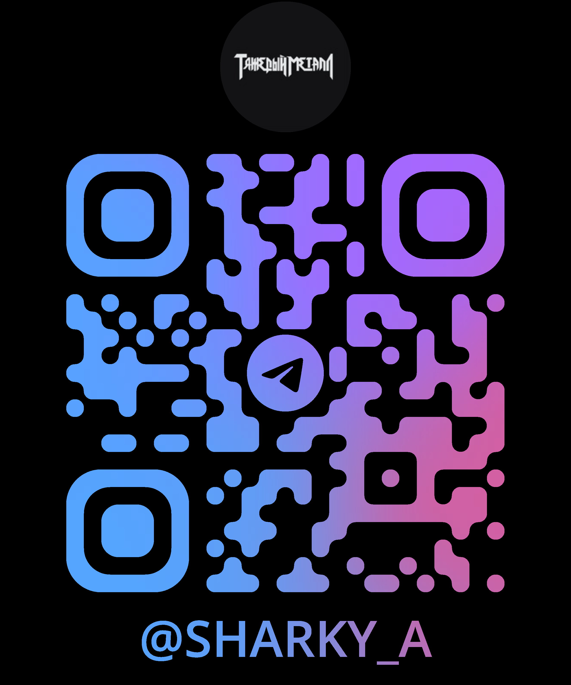

# 🎥 Сжиматор на NVENC


**Сжиматор на NVENC** — это мощное и удобное приложение для сжатия видео с использованием аппаратного ускорения NVIDIA NVENC. Программа поддерживает популярные форматы видео (MP4, AVI, MOV и др.) и позволяет гибко настраивать параметры сжатия: разрешение, битрейт, FPS, качество звука и многое другое.

---

## 🚀 Основные возможности

- **Аппаратное ускорение NVENC**: Использование видеокарт NVIDIA для быстрого и эффективного сжатия видео.
- **Поддержка популярных кодеков**:
  - 🎞️ Видео: H.265 (HEVC), H.264 (AVC).
  - 🎵 Аудио: AAC, MP3, без сжатия.
- **Гибкие настройки сжатия**:
  - 📏 Выбор разрешения (от 160x120 до 1920x1080).
  - 🎚️ Настройка битрейта видео и аудио.
  - 🎥 Изменение FPS и скорости воспроизведения.
- **🔖 Пресеты настроек**: Сохранение и загрузка конфигураций для быстрого повторного использования.
- **📊 Статистика сжатия**: Отображение исходного и конечного размера файла, процента сжатия и времени выполнения.
- **🎨 Интуитивный интерфейс**: Поддержка светлой и тёмной темы, настраиваемые цвета и фоновые изображения.

---

## 🖥️ Интерфейс


Программа имеет интуитивно понятный интерфейс, разделённый на несколько секций:

- **Выбор файла**: Укажите видео для сжатия.
- **Настройки видео**: Разрешение, битрейт, FPS, выбор кодека.
- **Настройки аудио**: Битрейт и выбор кодека.
- **Пресеты**: Сохранение и загрузка настроек.
- **Прогресс и логи**: Отслеживание процесса сжатия и вывод сообщений.

---

## 🛠️ Использование

1. **Выберите видеофайл**  
   Нажмите кнопку «Обзор...» и выберите файл для сжатия.

2. **Настройте параметры**  
   - **Разрешение**: Выберите из списка (от 160x120 до 1920x1080).
   - **Битрейт видео**: Укажите желаемый битрейт в Мбит/с.
   - **Битрейт аудио**: Укажите значение в кбит/с.
   - **FPS**: Установите частоту кадров.
   - **Скорость видео**: Измените скорость воспроизведения (от 0.5x до 2.0x).

3. **Выберите папку для сохранения**  
   Укажите, куда сохранить сжатый файл.

4. **Запустите сжатие**  
   Нажмите кнопку «Сжать видео» и дождитесь завершения процесса.

5. **Просмотрите статистику**  
   После завершения сжатия появится окно со статистикой: исходный размер, сжатый размер, процент сжатия и время выполнения.

---

## 📊 Примерный расчет размера файла

Программа автоматически рассчитывает примерный размер выходного файла на основе выбранных параметров и отображает его в реальном времени.

**Пример расчёта: **


- **Размер файла**: Отображается в мегабайтах (MB).
- **Процент сжатия**: Показывает, насколько уменьшился (или увеличился) размер файла по сравнению с исходным.

---

## 📦 Установка

### Требования

- **Операционная система**: Windows 10/11.
- **Видеокарта**: NVIDIA с поддержкой NVENC (например, GTX 10xx, RTX 20xx, RTX 30xx и выше).
- **FFmpeg**: Установленный [FFmpeg](https://ffmpeg.org/download.html) с поддержкой NVENC.

### Сборка из исходников

```bash
git clone https://github.com/sharkye1/Szhimatar.git
cd Szhimatar
python main.py
```
## 🤝 Как помочь проекту
Если вам нравится проект, вы можете поддержать его следующими способами:

- ⭐ Поставьте звезду на GitHub. 
- 🐞 Сообщайте о багах и предлагайте улучшения через Issues.
- 💻 Отправляйте Pull Request с вашими улучшениями.



